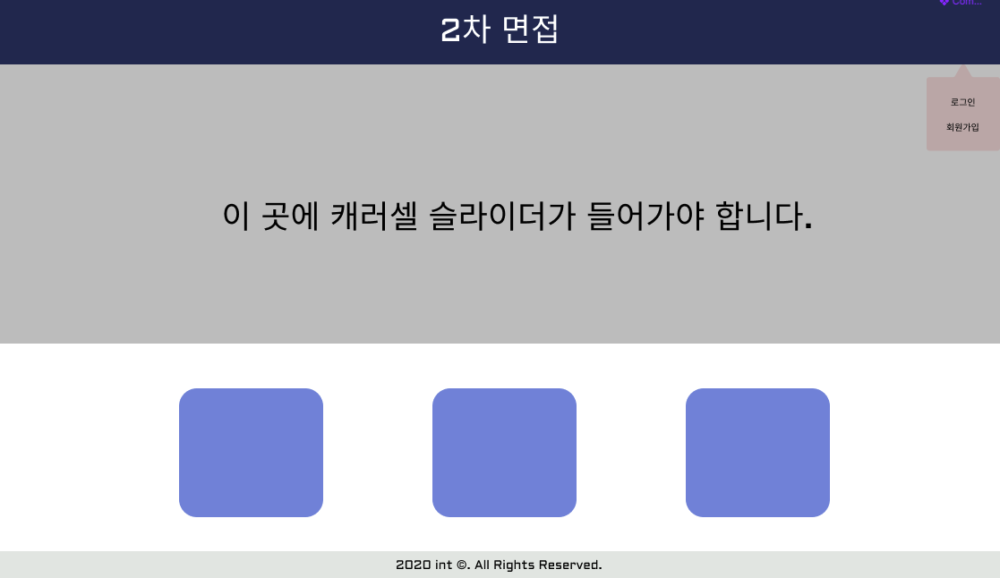

# 팀 int 웹 전형 프론트엔드 2차 면접

## 이동하기
이름 | 이동 버튼
------------ | -------------
웹 전형 프로트엔드 | [바로가기]()
준비중... | [바로가기]()

### 조건
 * 캐러셀 슬라이더가 들어가야 합니다.
 * 로그인/회원가입의 컨테이너는 위의 부모 요소를 클릭했을시에만 나타나여야/없어져야 합니다.
 * 색과 같은 중요하지 않은 요소들은 조금씩 바뀌어도 괜찮습니다.

### 방법

 1. 해당 레포지토리를 포크합니다.
 2. 포크한 레포지토리에 코딩을 합니다.
 3. 코딩이 끝난 후 개인 레포지토리에 해당 소스코드를 올려 풀 요청을 합니다.
 4. 제출 후 검토가 끝날 시 해당 레포지토리를 삭제해도 됩니다.

